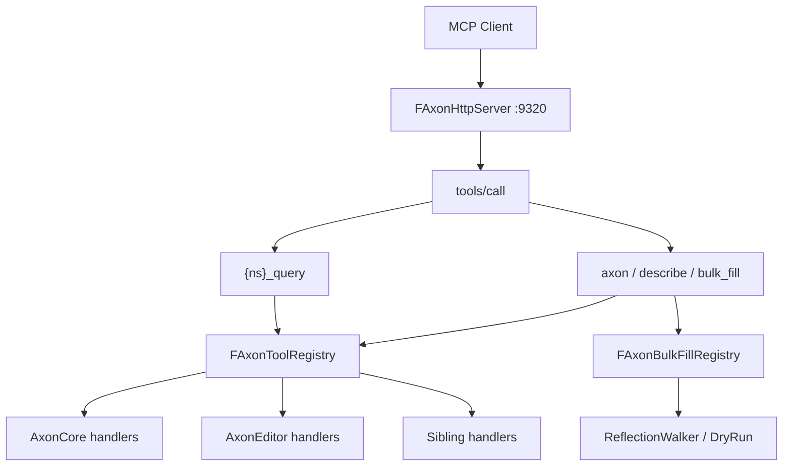

# 总架构与模块边界

> **角色**：说明 Axon 套件定位、Core / Editor / sibling 职责与主数据流，作为改造时的边界地图。  
> **何时阅读**：首次接触；判断改动应落在 Core、AxonEditor 还是 sibling 时。  
> **相关源码**：`Axon.uplugin`、`Source/AxonCore/`、`Source/AxonEditor/`、`Plugins/AxonMCPs/*`  
> **相关文档**：[00-routing.md](00-routing.md)、[02-glossary.md](02-glossary.md)、[30-sibling-plugins.md](30-sibling-plugins.md)  
> **最后更新**：2026-08-01

## 定位

Axon 是 **专为游戏 3C 制作链路设计的 Editor MCP**：

| 维度 | 说明 |
|------|------|
| **Character** | PIE 时序采样、AnimInstance / PoseSearch / Chooser / Motion Matching 脚手架、Rewind 动画 track |
| **Camera** | 视口/预览捕获；RewindDebugger 的 CameraBP watch（依赖 CameraBlueprint 插件） |
| **Control** | PIE Enhanced Input 注入、控制旋转、console、GAS 输入绑定脚手架 |

它不是运行时玩法框架，而是 **编辑器进程内的 Agent 总线**：HTTP JSON-RPC + Action 注册表 + 可选反射 bulk_fill。

与同仓库 **Monolith** MCP（常见端口 9316）的关系：可并存；工具面与端口不同。客户端须显式指向 `9320` 才打到 Axon。

## 模块边界

| 模块 / 插件 | Loading | 可依赖 | 不可做 |
|-------------|---------|--------|--------|
| **AxonCore** | Editor / PostEngineInit | HTTP、Registry、meta tools、describe/bulk_fill 框架、扩展脚手架 | 不承载具体动画/GAS/蓝图业务 Action |
| **AxonEditor**（同 uplugin） | Editor / PostEngineInit | `editor.*`：构建日志、地图、PIE 会话、输入、对象、预览捕获、Stat | 不把 animation/gas 领域 Action 塞进 Core |
| **Sibling**（`AxonAnimation` 等） | Editor / PostEngineInit | 各自 namespace 的 RegisterAction；可选 BulkFill adapter | 不修改 AxonCore 即可扩展；Shutdown 须 Unregister |

## 主数据流

1. `FAxonCoreModule::StartupModule`：若 `UAxonSettings::bMcpServerEnabled` 且非 commandlet → `FAxonHttpServer::Start(Port)`；注册 `axon` / `describe` / `bulk_fill`。
2. `FAxonEditorModule::StartupModule`：挂日志捕获；注册 `editor`（及部分 `animation.sample_pie_timeseries` alias）。
3. 各 sibling `StartupModule`：`RegisterAction`；可选 `FAxonBulkFillRegistry::RegisterAdapter`。
4. Client：`tools/list` / `tools/call` → Registry `ExecuteAction` → `FAxonActionResult` JSON。

## 关键类型锚点

| 概念 | 类型 | 路径 |
|------|------|------|
| 模块 | `FAxonCoreModule` | `Source/AxonCore/Public/AxonCoreModule.h` |
| HTTP | `FAxonHttpServer` | `Source/AxonCore/Public/AxonHttpServer.h` |
| 注册表 | `FAxonToolRegistry` | `Source/AxonCore/Public/AxonToolRegistry.h` |
| 结果 | `FAxonActionResult` | 同上 |
| 参数 schema | `FParamSchemaBuilder` | `Source/AxonCore/Public/AxonParamSchema.h` |
| BulkFill | `FAxonBulkFillRegistry` | `Source/AxonCore/Public/AxonBulkFillRegistry.h` |
| 设置 | `UAxonSettings` | `Source/AxonCore/Public/AxonSettings.h` |
| 点分读 | `AxonStructFieldResolver` / `AxonPieObject` | Core Public + `AxonEditor/Private/AxonPieObject.h` |
| PIE smoke | `FPieSmokeSessionManager` | `Source/AxonEditor/Private/AxonPieSmokeSession.h` |
| PIE timeseries | `FAxonPieSessionManager` | `Source/AxonEditor/Private/AxonPieSession.h` |
| Editor 入口 | `FAxonEditorModule` | `Source/AxonEditor/Public/AxonEditorModule.h` |

## 已知要点

1. **Core 保持瘦**：领域 Action 走 sibling；PIE 验证留在 AxonEditor。
2. **MCP 工具名 ≠ Action 名**：见 [10-mcp-protocol.md](10-mcp-protocol.md)。
3. **PIE 会话有两套 manager**（smoke vs timeseries），`poll_pie_smoke` 名称历史兼容；见 [13-pie-sessions.md](13-pie-sessions.md)、[60-known-debt.md](60-known-debt.md)。
4. **Unity Build**：跨 cpp 的匿名 namespace 同名 helper 会冲突；PIE 相关已改用 `*Private` 具名 namespace。

## 待充实

- 与 Monolith 工具面的正式对照表。
- `/Game/Tests/Axon/` harness 资产清单（若工程内存在）。
