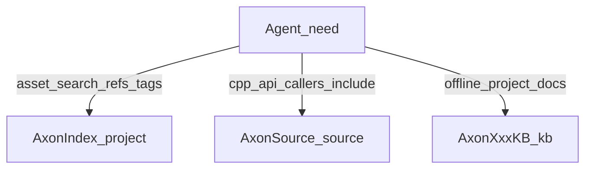

# AxonIndex 与 AxonSource

> **角色**：说明项目资产索引（Index）与 C++/Shader 源码索引（Source）的职责边界、何时用、怎么用。  
> **何时阅读**：要全项目搜资产 / 查引用；或查引擎 API、调用方、`#include` 路径时。  
> **相关源码**：`Plugins/AxonMCPs/AxonIndex/`、`Plugins/AxonMCPs/AxonSource/`  
> **相关文档**：[30-sibling-plugins.md](30-sibling-plugins.md)、[Docs/USER_GUIDE.md](../Docs/USER_GUIDE.md)、[Docs/axon_guide.md](../Docs/axon_guide.md)  
> **最后更新**：2026-08-04

## 一句话对照

| 插件 | MCP | 索引对象 | 典型问题 |
|------|-----|----------|----------|
| **AxonIndex** | `project_query` | 项目 **UAsset**（BP 节点/变量、材质、GAS、依赖、GameplayTag…） | 「谁引用了这个资产？」「项目里哪有 XXX 节点？」 |
| **AxonSource** | `source_query` | **Engine + Project C++ / Shader** 符号与源码 | 「这个 API 签名？」「谁调用了它？」「该 `#include` 什么？」 |

二者都是 **SQLite 结构化索引**，不是 Content Browser，也不是裸扫 `.uasset` / 全盘 `grep` 的替代品（虽可配合 `read_file`）。

与 **项目蒸馏（KB）** 的区别：Index/Source 查的是**当前工程实时/半实时索引**；KB（`gasp_kb` / `{project}_kb`）是**离线蒸馏 Markdown**，可不依赖源 Content。见 [31-knowledge-distill.md](31-knowledge-distill.md)。

## AxonIndex（`project`）

### 何时用

- 全项目 FTS 搜资产名、蓝图节点、变量等  
- 按类型列举 / 查 GameplayTag  
- 资产依赖与反向引用  
- 深详情、索引统计、导出资产文本（兜底）

### 索引与 DB

| 项 | 值 |
|----|-----|
| DB | `Plugins/AxonMCPs/AxonIndex/Saved/ProjectIndex.db` |
| 时机 | **编辑器启动后自动**（Asset Registry ready）；首次全量，之后增量 |
| 开关 | Project Settings 可关索引 / 推迟首次索引（`Axon.StartIndex`） |
| 维护 | `refresh_assets`；清理沙箱 `cleanup_generated_assets`（默认 `/Game/Tests/Axon/`，常 dry-run） |

### 常用 Actions

| 组 | Actions |
|----|---------|
| 搜索 | `search`、`find_by_type`、`list_gameplay_tags`、`search_gameplay_tags` |
| 读取 | `get_asset_details`、`get_stats`、`get_saved_asset_state`、`export_asset_text` |
| 引用 | `find_references` |
| 维护 | `refresh_assets`、`cleanup_generated_assets` |

### Gotchas

- 深索引会 **load 资产**，大工程注意内存；可 defer 首次索引。  
- 编辑器已打开 DB 时，commandlet 再开同一 DB 可能 WAL / disk I/O 失败。  
- `export_asset_text` 可能很大：优先 typed read（blueprint/animation…），T3D 请加 filter / max_bytes。

## AxonSource（`source`）

### 何时用

- 查类/函数签名、符号上下文、模块信息  
- 引用 / 调用方 / 被调 / 继承树  
- 搜源码与用法示例、canonical include  
- 弃用检查、符号校验、头文件 lint、生成 class stub 文本（**不写盘**）

### 索引与 DB

| 项 | 值 |
|----|-----|
| DB | `Plugins/AxonMCPs/AxonSource/Saved/EngineSource.db`（可覆盖路径） |
| 时机 | **启动不自动全量**；无 DB 时需先 `trigger_reindex` |
| 全量 | `trigger_reindex` → engine + shaders + project |
| 增量 | `trigger_project_reindex`；Live Coding 后可自动 project 增量（有冷却） |
| 门控 | `UAxonSettings::bEnableSource` |

### 常用 Actions

| 组 | Actions |
|----|---------|
| 搜索 | `search_source`、`find_example_usage` |
| 读取 | `read_source`、`read_file`、`get_symbol_context`、`get_signature`、`get_include_path`、`get_module_info`、… |
| 图 | `find_references`、`find_callers`、`find_callees`、`get_class_hierarchy` |
| 维护 | `trigger_reindex`、`trigger_project_reindex` |

### Gotchas

- 首次使用前通常要跑一次 **全量 reindex**（耗时，视引擎体量）。  
- 同进程对同一 `EngineSource.db` 多重打开可能 disk I/O（UE SQLite VFS 限制）。  
- reindex 期间 DB 关闭，查询可能短暂失败。  
- 引擎类体内方法未必有独立 symbol 行；Private 头可能 `includable:false`。  
- `generate_class_stub` / `lint_header`：后者可不依赖完整索引；stub **只返回文本**。

## Agent 选用速查

| 用户意图 | 调用 |
|----------|------|
| 项目里找资产 / BP 节点 / Tag | `project_query` → `search` / `find_by_type` / `search_gameplay_tags` |
| 谁依赖了 `/Game/...` | `project_query` → `find_references` |
| 引擎 API 签名 / 读实现 | `source_query` → `get_signature` / `read_source`（无库则先 `trigger_reindex`） |
| 谁调用了某函数 | `source_query` → `find_callers` |
| 该 include 哪个头 | `source_query` → `get_include_path` |
| 离线问「GASP 怎么设计的」 | `gasp_kb_query` / `{ns}_kb_query`（不是 Index/Source） |

## 维护勾选

- [ ] 改 Index/Source Action 面 → 同步本文 + `30-sibling-plugins.md` + USER_GUIDE  
- [ ] 改默认 DB 路径 / 启动索引策略 → 同步本文 Gotchas 与插件 README  
