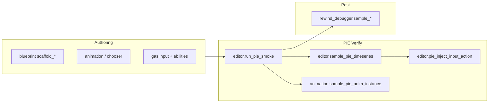

# 3C 工作流（AI 编排）

> **角色**：把套件能力映射到 Character / Camera / Control 验证链，供 Agent 选 Action。  
> **何时阅读**：用户要做 locomotion / 输入 / 镜头相关 MCP 任务时。  
> **相关源码**：见各步骤标注；人类可读版见 [Docs/3C_WORKFLOWS.md](../Docs/3C_WORKFLOWS.md)  
> **相关文档**：[13-pie-sessions.md](13-pie-sessions.md)、[30-sibling-plugins.md](30-sibling-plugins.md)、[40-editor-actions.md](40-editor-actions.md)  
> **最后更新**：2026-08-01

## 总览

调用前：`axon_status` → 必要时 `list_errored_blueprints`。

## Character（角色）

| 目标 | 推荐链 |
|------|--------|
| Motion Matching / 移动脚手架 | `blueprint.scaffold_motion_matching_character` → locomotion input/anim values → `animation` 图/Chooser 工具 |
| 短时 locomotion 回归 | `editor.run_pie_smoke`（`sample_vars`、`console_script`、`pawn_class`）→ `poll_pie_smoke` |
| 带画面的移动 clip | `capture_pie_movement_clip` → `poll_pie_smoke` |
| 点分变量时序 | `sample_pie_timeseries`（`variables`、`provocations`）→ `poll_pie_smoke` |
| Live AnimInstance | `animation.sample_pie_anim_instance` |
| 回放骨骼/状态机 | `rewind_debugger.start_recording` … → `sample_anim_nodes` / `sample_skeletal_pose` |

默认 smoke 变量常含 `GroundSpeed`、`bShouldMove`、`DesiredYawDelta`（以 schema 默认为准）。

## Camera（镜头）

| 目标 | 推荐链 |
|------|--------|
| 视口/资产预览图 | `capture_scene_preview` / `capture_anim_frames` / `capture_with_overlay` |
| Clip 对准角色 | `capture_pie_movement_clip` + `view_target_actor` |
| CameraBP 图结果回放 | `rewind_debugger.sample_camera_graph_result` / `sample_camera_watches`（需 CameraBlueprint） |

无独立 `camera` namespace sibling——镜头制作系统本身通常在项目 CameraBlueprint 插件。

## Control（操控）

| 目标 | 推荐链 |
|------|--------|
| PIE 中注入 Enhanced Input | `pie_inject_input_action` |
| 转视角 | `pie_set_control_rotation`；timeseries provocation `set_control_rotation` |
| 控制台指令 | `run_console_command` 或 smoke `console_script` / probe |
| 能力输入绑定 authoring | `gas.setup_ability_input_binding` / `bind_ability_to_input` / `scaffold_input_binding_component` |
| 调输入/移动相关 Settings | `config.resolve_setting` / `search_config` /（慎）`set_developer_setting` |

## 安全默认

1. PIE 前 `on_compile_errors=refuse`。  
2. 换图前确保无 resident PIE / 无 running session。  
3. bulk_fill 先 `dry_run=true`。  
4. `save_packages` 注意 `fail_on_unrequested_dirty`。

## 待充实

- 与项目 `/Game/Tests/Axon` harness 地图的固定参数模板。
- CameraBlueprint 图节点 ↔ Rewind track 字段对照。
