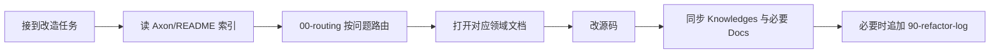

# AI 协作与知识库维护

> **角色**：约定 AI / 协作者在改 Axon 套件时如何读写知识库，保证文档不腐化。  
> **何时阅读**：任何改代码会话开始前（与 README 一起）；改完准备收尾时。  
> **相关源码**：无（过程约定）  
> **相关文档**：[README.md](../README.md)、[00-routing.md](00-routing.md)、[90-refactor-log.md](90-refactor-log.md)  
> **最后更新**：2026-08-01

## 标准工作流

1. **读** [README.md](../README.md)。  
2. **路由** [00-routing.md](00-routing.md)。  
3. **读** 领域文档（及 [02-glossary.md](02-glossary.md)）。  
4. **改** 源码（遵守 [01-architecture.md](01-architecture.md) 边界）。  
5. **同步** 文档（见下表）。  
6. **记日志**：架构/行为决策 → [90-refactor-log.md](90-refactor-log.md)，并更新 README「改造状态」。

## 改动类型 → 必须更新的文档

| 改动类型 | 必须更新 | 建议更新 |
|----------|----------|----------|
| 模块边界 / 主数据流 | `01-architecture.md`、README | `00-routing.md`、`Plugins/AxonMCPs/README.md` |
| 新术语 | `02-glossary.md` | 引用处检索 |
| HTTP / 端口 / 工具映射 | `10-mcp-protocol.md` | `Docs/USER_GUIDE.md`、`Docs/SPEC_CORE.md` |
| Registry / ParamSchema 约定 | `11-action-registry.md` | `50-extension-cookbook.md` |
| describe / bulk_fill / adapter | `12-describe-bulk-fill.md` | `30-sibling-plugins.md` |
| PIE smoke / timeseries / 门禁 | `13-pie-sessions.md` | `51-3c-workflows.md`、`Docs/3C_WORKFLOWS.md`、`40` |
| 新 sibling / namespace | `30-sibling-plugins.md`、README | `50`、`Docs/USER_GUIDE.md` |
| 蒸馏 / KB 包 / KnowledgeLib / gasp_kb | `31-knowledge-distill.md`、`30-sibling-plugins.md` | `Docs/USER_GUIDE.md`、`Docs/axon_guide.md`、`AxonKnowledgeLib/README.md` |
| Index / Source 索引行为或 Action 面 | `32-index-and-source.md`、`30-sibling-plugins.md` | `Docs/USER_GUIDE.md`、各插件 README |
| `editor.*` 注册面 | `40-editor-actions.md` | `51` |
| 扩展流程 | `50-extension-cookbook.md` | `Docs/SIBLING_PLUGIN_GUIDE.md`、`Docs/axon_guide.md` |
| 3C 推荐链 | `51-3c-workflows.md` | `Docs/3C_WORKFLOWS.md` |
| 技术债 | `60-known-debt.md` | `90-refactor-log.md` |
| 任何架构/行为决策 | `90-refactor-log.md`、README 改造状态 | |

## 文档分工

| 位置 | 受众 | 内容 |
|------|------|------|
| `.Knowledges/` | AI / 协作者 | 边界、路由、债务、源码锚点 |
| `Docs/USER_GUIDE.md` / `3C_WORKFLOWS.md` | 人类用户与开发者 | 接入、操作链、注意事项 |
| `Docs/axon_guide.md` | Agent 英文速查 | onboarding / recipes / errors（由 `axon_guide` Action 服务） |
| `Docs/SPEC_CORE.md` | 规格摘要 | 端口、公共 API |

- **禁止**在 `.Knowledges` 外再散落第二套「插件内部知识」；人类手册放 `Docs/`，并在 README 索引互链。  
- **禁止**把数百 Action 逐条抄进 md；工作流 + `axon_discover` 为权威。  
- **语言**：Knowledges 中文正文 + API 英文；`axon_guide.md` 可保持英文（Action 消费）。

## 会话收尾检查清单

- [ ] README 索引仍准确  
- [ ] `00-routing.md` 是否需新行  
- [ ] 触及领域文档「最后更新」已改  
- [ ] 人类 Docs 若受影响已同步  
- [ ] 决策 → `90-refactor-log.md`  
- [ ] 还债 → `60-known-debt.md` 标记  
- [ ] README「改造状态」一致  
